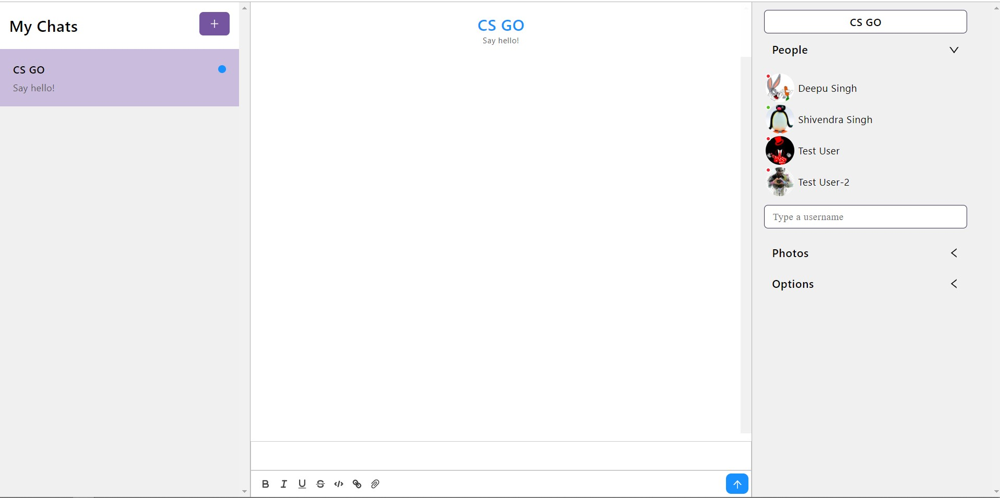

<h1 align="center">Chat Application</h1>
<h5 align="center">An intelligent communication and collaboration tool, built for teams</h5>

<br/>

## 🎯 About

This project was built with the purpose of learning how to structure a Web App of a mid-level complexity integrating the React Chat Engine API. I put a lot of effort into it and I hope that you could like it.<br/><br/>
The Web App lands you to an Authentication page, in which you can choose to sign in with any of the accounts given below. Once you are logged in, you will land on the homepage, in which you can find the chats.<br/>
You can add a user by entering the username of the user in the "type a username" input box and press enter to add the user.<br/>
➡️ Go try it and please let me know if you enjoyed it with a ⭐️, I would appreciate it a lot.
<br/>
<br/>

## ▶️ Demo

Here you can find the demo link:

[https://chat-application-ab12.netlify.app](https://chat-application-ab12.netlify.app/)

### Test credentials

> Email: test@user.com<br/>
> Password: testUser<br/>

<br/>

> Email: test@user2.com<br/>
> Password: testUser2<br/>


## ✨ Features

✔️: &nbsp;&nbsp;Display chats, old and recently updated<br />
✔️: &nbsp;&nbsp;Add User functionality<br />
✔️: &nbsp;&nbsp;React-Chat-Engine API (credits: [alamorre/react-chat-engine](https://github.com/alamorre/react-chat-engine)) for the Chat UI and functionality<br />
✔️: &nbsp;&nbsp;User Sign In<br />
✔️: &nbsp;&nbsp;Use of React hooks<br />
✔️: &nbsp;&nbsp;Responsive layout<br />
✔️: &nbsp;&nbsp;Swipeable chat content<br />

## 🚀 Technologies

- [React](https://reactjs.org/)
- [React Hooks](https://reactjs.org/docs/hooks-intro.html)
- [React-Chat-Engine](https://chatengine.io/)
- [Netlify](https://www.netlify.com/)

  <br/>

# 📸 Screenshots

## Home Page


<br/>
<br/>

## ✅ Requirements

Before starting you need to have [Git](https://git-scm.com) and [Node](https://nodejs.org/en/) installed.

<br/>

## 🔗 Run Locally

- Clone the project

```bash
  git clone https://github.com/shivendradb/Chat-application-using-React-JS.git
```

- Go to the project directory

```bash
  cd Chat-application-using-React-JS
```

- Install dependencies

```bash
  npm install
```

- Start the server

```bash
  npm start
```

Note: <br/>
The page will reload if you make edits. <br/>
You will also see any lint errors in the console.

<br/>

You can **contact me** in case of any issues or discrepancies. <br/>

#### **Please let me know if you enjoyed it with a ⭐️, I would appreciate it a lot.**
